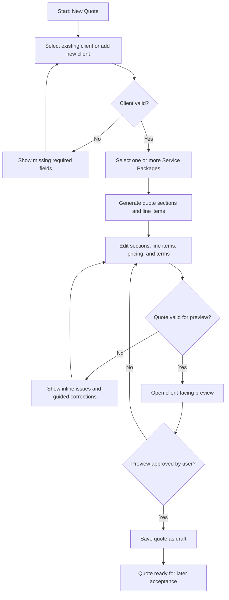
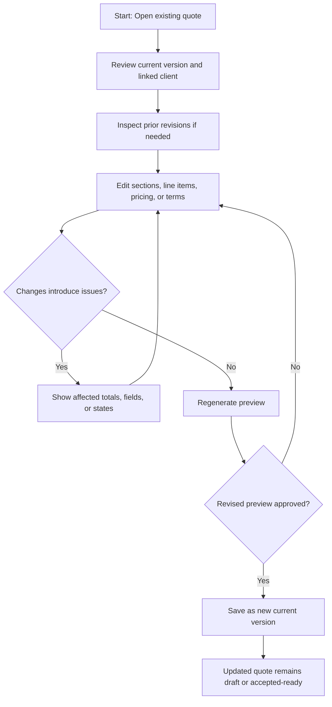
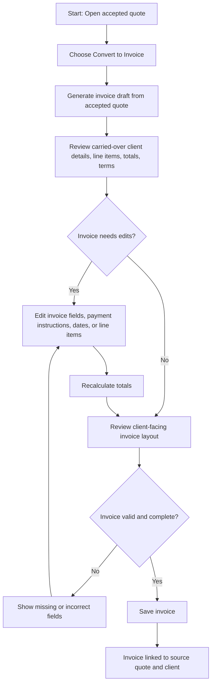

# UX Design Specification mento-admin

**Author:** chuck chuck
**Date:** 2026-03-15 15:38:37 MST

---

<!-- UX design content will be appended sequentially through collaborative workflow steps -->

## Executive Summary

### Project Vision

mento-admin is a desktop-first web application for a single creative studio that streamlines the workflow from quote creation through invoice generation. Its UX goal is to help a studio owner move from opportunity to polished quote without breaking creative rhythm, using a workflow that feels faster, more trustworthy, and more professional than spreadsheets, PDFs, and ad hoc documents. The product should remain intentionally narrow in MVP scope, emphasizing speed, clarity, persistence, and low administrative overhead over configurability or SaaS-style complexity.

### Target Users

The primary users are solo or small creative studio owners and managers who are also actively involved in delivery work. They switch frequently between creative tasks and commercial tasks, so the product must reduce interruption and help them respond quickly to client opportunities. These users need a workflow that feels lightweight, credible, and easy to control, especially when revising quotes, maintaining reusable service packages, or converting accepted quotes into invoices. Secondary users such as collaborators or additional studio roles are out of scope for the MVP but may influence future expansion.

### Key Design Challenges

The first design challenge is balancing power with simplicity: the quote builder must support reusable service packages, stacked sections, pricing edits, revisions, and invoice conversion without feeling bloated or complex. The second is maintaining trust throughout the workflow, especially in preview quality, quote revisions, accepted-state handling, and quote-to-invoice continuity. The third is creating a desktop-first information architecture that keeps clients, service packages, quotes, invoices, defaults, and history easy to navigate while preserving a strong focus on the core commercial flow.

### Design Opportunities

The strongest UX opportunity is to make the quote preview the trust-building centerpiece of the product, giving users a clear professional checkpoint before moving forward. Another opportunity is to design the Studio Quote Builder as the hero experience, supported by intentionally shallow but believable surfaces for client management, service package maintenance, and invoice follow-up. A third opportunity is to use clear state transitions, linked records, and visible continuity across clients, quotes, revisions, and invoices to make the product feel dependable in both happy-path and troubleshooting scenarios.

## Core User Experience

### Defining Experience

The core user experience of mento-admin is preparing quotes quickly and confidently. Quote preparation is the dominant user action and the most critical interaction to get right. The product should feel centered around helping a studio owner move from client need to polished quote with as little friction and hesitation as possible. Invoice creation is the important follow-through action, but it should feel like a natural extension of the quote workflow rather than a separate system.

### Platform Strategy

mento-admin should be designed as a desktop-first web application for the MVP, optimized primarily for mouse and keyboard interaction. There are no hard platform constraints, no offline requirements, and no device-specific capabilities that need to shape the initial UX. Future iPad or mobile variation may become relevant later if the product expands into a multi-tenant platform, but the current UX should prioritize a fast and efficient desktop workflow.

### Effortless Interactions

The most effortless interactions should be preparing quotes, adding clients, and creating invoices from accepted quotes. The current alternatives are manual and inconsistent, so the product should remove repetitive setup, reduce ambiguity, and make quote-building feel structured rather than improvised. The greatest delight comes from making quote preparation feel seamless and reliable. Automation opportunities are not fully defined yet, so the experience should focus first on clarity, speed, and continuity rather than hidden system behavior.

### Critical Success Moments

The most important success moment is when preparing a quote feels seamless and clearly better than the user's current workflow. A user should feel successful when they can create a quote easily and then turn that quote into an invoice even more easily. The most important make-or-break flows are quote creation and quote-to-invoice conversion. These moments define whether the product feels trustworthy and worth adopting. Some failure conditions are not fully defined yet, but any friction that makes quoting feel harder, slower, or less reliable would significantly damage the experience.

### Experience Principles

- Quote preparation is the hero workflow and should dominate UX decisions.
- Speed and consistency matter more than configurability in the MVP experience.
- Invoice creation should feel like the simplest next step after a successful quote.
- The interface should reduce manual effort and ambiguity rather than introduce clever complexity.

## Desired Emotional Response

### Primary Emotional Goals

The primary emotional goal of mento-admin is confidence. Users should feel that they can prepare quotes quickly, present them professionally, and trust the workflow from quote creation through invoicing. Supporting emotional goals are speed, ease, and professionalism, so the product feels efficient without feeling cold or mechanical. A small but important positive reaction is that the product should feel nice to use, meaning smooth, clean, and reassuring rather than merely functional.

### Emotional Journey Mapping

When users first enter the product, they should feel confident that the workflow is straightforward and under control. During quote preparation, they should feel confident and fast, with the interface reinforcing that they are building something professional rather than struggling through admin work. After completing a quote, they should feel a sense of ease and satisfaction, ideally with a reaction of "nice, that was easy." After converting a quote into an invoice, that confidence should increase because the next step feels even simpler. If something goes wrong, the product should still preserve confidence by making the issue understandable and recoverable rather than stressful or confusing. When users return, the experience should feel familiar, dependable, and consistently confidence-building.

### Micro-Emotions

The most important micro-emotion is confidence over confusion. Trust is more important than surprise, because users need to believe the quote and invoice workflow is dependable. Accomplishment should replace frustration, especially after creating a polished quote or converting it into an invoice. Satisfaction is more important than flashy delight, but a subtle sense of polish and ease should make the product feel noticeably better than manual alternatives.

### Design Implications

To support confidence, the UX should use clear structure, explicit statuses, dependable navigation, and unambiguous actions throughout the workflow. To support speed and ease, quote preparation should minimize unnecessary decisions, reduce repetitive entry, and make the next step obvious at every stage. To support professionalism, preview quality, layout clarity, and polished presentation should be treated as essential UX requirements rather than cosmetic enhancements. Negative emotions to avoid include confusion, hesitation, skepticism, and frustration, especially during quote editing, revision, and quote-to-invoice conversion.

### Emotional Design Principles

- Design every major workflow to reinforce user confidence.
- Make speed feel safe, not rushed or fragile.
- Keep the interface polished enough to support a professional self-image.
- Favor clarity, reassurance, and smooth follow-through over novelty or cleverness.

## UX Pattern Analysis & Inspiration

### Inspiring Products Analysis

The strongest explicit inspiration source identified so far is Vercel. The most relevant qualities are simplicity and directness. From a UX perspective, this suggests an interface that avoids unnecessary noise, keeps the primary action obvious, and makes the path forward feel clear at every stage. The compelling quality is not decorative delight but the feeling that the product respects the user's time and attention. For mento-admin, this is especially relevant because the product must replace manual and inconsistent workflows with something that feels immediately clearer and easier to operate.

### Transferable UX Patterns

A key transferable pattern is clear visual priority, where the main action on a screen is always obvious. Another is interface restraint, where only the most important controls and information are emphasized, helping users stay focused on the core task. A third is direct workflow progression, where users are not forced to interpret complex navigation or configuration before moving forward. For mento-admin, these patterns could support quote preparation by making client selection, service package selection, quote editing, preview, and invoice conversion feel linear and understandable rather than administrative and cluttered.

### Anti-Patterns to Avoid

A major anti-pattern to avoid is crowded admin-style interfaces that give equal weight to too many actions at once. Another is vague workflow state, where users are unsure whether a quote is draft, accepted, revised, or invoiced. A third is over-configuration early in the experience, which would conflict with the product's speed, confidence, and professionalism goals. Any UX pattern that makes quoting feel heavier than the current manual process would undermine the product's core value.

### Design Inspiration Strategy

The design strategy should adopt simplicity, directness, and clear action hierarchy from Vercel-inspired interfaces. These qualities should be adapted to a quote-first workflow, where the hero action is always easy to identify and surrounding support surfaces remain intentionally light. The product should also adapt this simplicity to professional commercial workflows by making statuses, transitions, and next steps unmistakably clear. It should avoid clutter, dashboard bloat, excessive setup steps, and any interaction model that hides the quote workflow behind generic administrative complexity.

## Design System Foundation

### 1.1 Design System Choice

The design system foundation for mento-admin should be a Geist-inspired system, using Vercel's design language as the primary reference point. This choice supports a balance between speed and a custom-branded feel, while aligning closely with the desired product qualities of simplicity, directness, confidence, and professionalism.

### Rationale for Selection

Geist is the right foundation because it matches the team's preference, supports a tight MVP timeline, and reflects the product's desired UX character. The interface needs to feel polished and custom, but the team does not have deep design-system specialization, so building a fully custom system from scratch would create unnecessary cost and risk. A Geist-inspired approach offers a restrained, modern, professional feel that aligns with the product's quote-first workflow and avoids the clutter of generic admin dashboards. It also supports the Vercel-like simplicity and directness already identified as the strongest inspiration source.

### Implementation Approach

The implementation approach should use Geist as the visual and interaction baseline for the MVP, especially for layout rhythm, typography, form controls, spacing, buttons, feedback states, and general hierarchy. The product should not aim to reproduce Vercel exactly, but should use the same principles of restraint, focus, and clarity. Standardized patterns should be established early for page shells, data tables, forms, workflow headers, status treatments, and action areas so the quote workflow remains consistent across clients, service packages, quotes, and invoices.

### Customization Strategy

The customization strategy should focus on making the product feel like its own brand while preserving the simplicity and discipline of Geist. This means keeping the foundation minimal, then selectively customizing color application, workflow-specific components, quote-preview presentation, and record-status patterns to support the commercial use case. Custom components should be introduced only where the quote-building workflow needs specialized behavior, while common interface elements should remain as close as possible to the design system foundation for speed, consistency, and maintainability.

## 2. Core User Experience

### 2.1 Defining Experience

The defining experience of mento-admin is creating a polished client quote through a simple, structured workflow that feels dramatically easier than working in spreadsheets or documents. If the product gets one thing right, it should be this: a user can start a new quote, connect it to the right client, choose the right reusable content or line items, and reach a trustworthy preview without friction or duplicated work. This is the interaction users would describe to others because it is the clearest expression of the product's value.

### 2.2 User Mental Model

Users currently think about quote creation through manual tools such as spreadsheets and documents. Their existing mental model is based on copying previous work, editing it by hand, and stitching together a quote from repeated fragments. They expect the new flow to be super simple and much more direct than that. Their biggest frustration is repeated manual work and inconsistency, where every quote feels like rebuilding something that should already exist. The UX should respect this mental model by feeling familiar enough to understand immediately, while removing the repetitive and error-prone parts of the current process.

### 2.3 Success Criteria

The core experience succeeds when users feel that quote creation is obvious, fast, and dependable. A successful interaction should make users say "this just works" because they can move from a new quote to a polished preview without duplicated effort or uncertainty. The workflow should feel fast enough that quote creation is no longer a disruptive admin task. Users should receive clear feedback through visible structure, obvious next steps, and a polished preview that confirms they are building the right thing correctly.

### 2.4 Novel UX Patterns

The core interaction should rely primarily on established UX patterns such as forms, lists, sections, and preview-driven workflow because users already understand those models. However, there is room to explore a stronger and slightly more opinionated experience within that familiar foundation. The opportunity is not radical novelty, but a cleaner and more guided quote-building flow that feels more direct and better orchestrated than generic admin tools. The unique twist should come from how smoothly the quote workflow progresses, not from forcing users to learn an unfamiliar interface pattern.

### 2.5 Experience Mechanics

The quote workflow should begin with a clear "new quote" action. From there, the user should either pick an existing client or add a new one, then choose the relevant service packages or quote-specific line items needed for the quote. The system should guide the user through a straightforward structure rather than exposing too many competing actions at once. Preview should appear as a clear validation step before the user moves onward. After preview, the MVP workflow may continue through internal acceptance and later invoice conversion; send and deposit remain post-MVP considerations. The user should know they are done when the quote preview feels polished, complete, and ready for the next action.

## Visual Design Foundation

### Color System

The color system for mento-admin should follow a Geist-inspired neutral base with a restrained green accent. The primary interface palette should rely on black, white, layered grays, and subtle borders to preserve clarity, directness, and a calm professional tone. Green should be used selectively to signal positive progression, success states, accepted statuses, and key forward actions where reassurance matters. Color should support hierarchy rather than decoration, keeping the interface focused and controlled. Semantic mappings should remain clear and conventional: neutral tones for structure, green for positive and confirmatory states, amber for caution, red for destructive or error states, and blue only if needed for informational emphasis. Contrast should remain strong enough for confident scanning across forms, data views, previews, and workflow states.

### Typography System

The typography system should feel professional and calm, with strong emphasis on legibility and restraint. A Geist-aligned sans-serif foundation is appropriate, using a clean modern typeface for interface text and workflow controls. Because most product content is short-form UI text, the hierarchy should prioritize crisp section headings, compact labels, readable table content, and clean action text rather than editorial-style long reading. Type scale should clearly distinguish page titles, section headers, field labels, helper text, and data values without making the interface feel oversized or noisy. The typography should reinforce confidence by feeling precise, quiet, and well-structured.

### Spacing & Layout Foundation

The spacing and layout system should use an 8px base rhythm to create a balanced interface that feels orderly without being either cramped or overly airy. The overall product should behave like a focused workspace with focused metrics depending on context, not a dashboard that tries to surface everything at once. Layouts should prioritize page clarity, strong sectioning, and clear action grouping so users can move through quote creation, client selection, service package selection, preview, and invoice follow-through without distraction. White space should be used intentionally to separate workflow steps, reinforce hierarchy, and reduce cognitive load. Grid usage should support a desktop-first workspace, likely through a predictable content column structure with optional supporting side panels or secondary information zones where functionally useful.

### Accessibility Considerations

Although there are no special accessibility requirements beyond standard quality expectations, the visual system should still support confident and readable operation. Text contrast should remain strong across neutral surfaces, form controls should preserve clear focus states, and status colors should not be the only signal used to communicate meaning. Typography sizes should remain readable in dense workspace contexts, especially for table rows, form labels, and quote line items. The interface should preserve clarity under keyboard navigation and avoid subtle visual distinctions that might weaken trust or usability.

## Design Direction Decision

### Design Directions Explored

Six visual directions were explored for mento-admin through the HTML showcase, all built on the same Geist-inspired foundation of neutral structure, restrained green accenting, calm typography, and desktop-first workflow design. The variations tested different balances of workspace layout, guided sequencing, preview emphasis, density, and action hierarchy. The explored directions included a balanced workspace model, a guided sequence model, a preview-centered presentation model, a denser operator view, a split builder/live preview model, and a minimal command workspace model.

### Chosen Direction

The selected direction is Direction 2, the Guided Sequence approach. This direction organizes quote creation into a clear staged workflow, helping users move confidently from client selection to service packages, line items, and preview. It gives the product a more opinionated structure than a generic admin workspace while still relying on familiar patterns that users can understand immediately.

### Design Rationale

Direction 2 is the best fit because it supports the core UX goal of making quote preparation feel simple, obvious, and confidence-building. It directly addresses the user's current frustrations with manual and inconsistent workflows by turning quote creation into a calm, structured sequence with visible progress. This direction also aligns well with the product's confidence-first emotional goals, because it reduces ambiguity and makes the next step clear at every stage. Compared with more open or denser layouts, it gives stronger support for first-time clarity without sacrificing professionalism.

### Implementation Approach

The implementation should treat the quote builder as a staged workflow with explicit progress states, while preserving enough flexibility for users to move quickly once they understand the system. Each stage should have a clear purpose, minimal competing actions, and visible completion signals. The interface should emphasize progression toward preview as the key trust checkpoint, with later MVP workflow phases focused on preview, internal acceptance, and invoice conversion, while send and deposit remain post-MVP. The final implementation should keep the visual language calm and restrained, using Geist-inspired spacing, typography, and neutral surfaces so the guided flow feels polished rather than heavy-handed.

## User Journey Flows

### Create Send-Ready Quote

This flow is the core product experience. It should feel guided, calm, and fast. The user starts from a clear `New Quote` entry point, links or creates the client, selects one or more Service Packages, reviews the generated structure, makes pricing or scope edits, and validates the result in preview before saving or moving forward.

Key UX requirements:
- Progress is visible across the guided sequence
- The system distinguishes reusable Service Packages from editable quote content
- Preview acts as the trust checkpoint before the quote is considered ready
- Errors are recoverable without losing progress

Success state:
- User reaches a client-facing preview in under 3 minutes
- The quote is saved as a durable draft
- The next step is obvious

### Revise Quote With Continuity

This flow protects confidence after client feedback. The user reopens an existing quote, reviews the current version and revision history, updates the relevant content, regenerates preview, and saves the revised version without losing prior context.

Key UX requirements:
- Revision state is obvious
- Current version and prior versions are clearly distinguished
- Totals update immediately and transparently
- The user never feels like they are rebuilding from scratch

Success state:
- Revision history remains intact
- The current version is easy to identify
- The revised quote still feels professional and trustworthy

### Convert Accepted Quote To Invoice

This flow should feel like the simplest downstream action in the system. Once a quote is in accepted state, the user converts it into an invoice, reviews carried-over data, makes any allowed invoice edits, and finalizes a client-facing invoice layout for manual delivery.

Key UX requirements:
- Conversion is only available from the correct state
- Carryover from quote to invoice is transparent
- Linked record continuity is visible
- The invoice should be reachable in under 1 minute from an accepted quote

Success state:
- Invoice is created from an accepted quote in under 1 minute
- Record lineage is preserved and visible
- Manual delivery is supported without extra reconstruction

### Journey Patterns

Common patterns across all three flows should be standardized.

**Navigation Patterns**
- Guided sequence headers with explicit current, completed, and next states
- Safe return paths to the prior step without data loss
- Connected record links between client, quote, revision, and invoice

**Decision Patterns**
- Validate before advancing to the next stage
- Keep irreversible-looking actions behind clear readiness states
- Show source-vs-instance boundaries clearly, especially between Service Packages and quote content

**Feedback Patterns**
- Inline validation before hard stops
- Immediate recalculation feedback for totals and pricing changes
- Explicit save, failure, and recovery messaging for every key workflow action

**Recovery Patterns**
- Preserve user progress when fields are incomplete
- Trace errors back to source records and editable fields
- Keep correction loops short and local to the current task

### Flow Optimization Principles

- Optimize for fastest path to preview, not maximum upfront configuration
- Reduce cognitive load by revealing only the decisions needed for the current stage
- Use preview as the main trust-building checkpoint in the quote flow
- Make revision feel like controlled continuation, not duplication and rebuild
- Make invoice conversion feel like a direct continuation of an accepted quote
- Preserve confidence with clear statuses, visible history, and recoverable error states

## Component Strategy

### Design System Components

The Geist-inspired design system should provide the foundation layer for the product. Standard components should be used wherever possible for consistency, implementation speed, and accessibility.

Foundation components expected from the design system:
- Buttons and icon buttons
- Inputs, textareas, selects, comboboxes, and checkboxes
- Cards, panels, dividers, and layout containers
- Tables and list rows
- Tabs and segmented controls
- Badges, status chips, and helper text
- Dialogs, drawers, dropdown menus, and popovers
- Toasts, inline alerts, and empty states

These components should cover most generic UI needs across clients, service packages, quotes, invoices, defaults, and settings. Custom component work should focus only on workflow-specific interactions that are central to the quote experience.

### Custom Components

### Guided Flow Header

**Purpose:** Show where the user is in the quote workflow and what comes next.  
**Usage:** Used across quote creation, revision, preview, and invoice conversion flows.  
**Anatomy:** Step labels, current step indicator, completed states, optional status note, primary next action.  
**States:** Default, current, completed, blocked, error.  
**Variants:** Quote creation, quote revision, invoice conversion.  
**Accessibility:** Step list should expose semantic order and current-step state; keyboard focus must reach all navigable steps.  
**Content Guidelines:** Use short action labels such as `Client`, `Service Packages`, `Edit`, `Preview`, `Invoice`.  
**Interaction Behavior:** Users can move backward safely; forward movement should respect validation and readiness rules.

### Service Package Picker

**Purpose:** Help users choose one or more reusable Service Packages when starting a quote.  
**Usage:** Appears during quote setup before quote content is generated.  
**Anatomy:** Search input, package rows/cards, summary metadata, select action, optional preview of included sections.  
**States:** Empty, loading, searchable results, selected, no matches.  
**Variants:** Compact list, richer card view.  
**Accessibility:** Search and selection must be keyboard operable; selection state must be announced clearly.  
**Content Guidelines:** Emphasize package name, short description, typical use case, and pricing guidance.  
**Interaction Behavior:** Selecting a package should update a lightweight selection summary before generation.

### Quote Structure Editor

**Purpose:** Let users edit generated quote content without confusing it with the underlying Service Package source.  
**Usage:** Core editing surface after quote generation.  
**Anatomy:** Section headers, line item rows, inline pricing fields, reorder controls, add/remove actions, totals summary.  
**States:** Default, editing, dragging/reordering, validation warning, saved, error.  
**Variants:** Dense desktop mode, simplified narrow mode.  
**Accessibility:** Keyboard editing and reordering alternatives are required; totals changes must be visible without relying on color alone.  
**Content Guidelines:** Keep labels explicit and pricing readable; distinguish editable quote content from reusable source content.  
**Interaction Behavior:** Changes should recalculate totals immediately and preserve draft continuity.

### Preview Readiness Panel

**Purpose:** Tell users whether the quote or invoice is ready for preview or final use.  
**Usage:** Appears during quote editing and invoice generation.  
**Anatomy:** Readiness status, missing items list, warnings, confidence summary, primary action.  
**States:** Ready, incomplete, warning, error.  
**Variants:** Side panel, inline summary card.  
**Accessibility:** Missing requirements must be readable as text and linked to the correct correction point.  
**Content Guidelines:** Use concise corrective language such as `Add client contact` or `Complete payment instructions`.  
**Interaction Behavior:** Clicking an issue should move the user to the relevant field or section.

### Revision Timeline

**Purpose:** Make quote revision history understandable and confidence-building.  
**Usage:** Used when reopening and revising existing quotes.  
**Anatomy:** Version list, timestamps, current version marker, revision note, compare/view action.  
**States:** Single version, multiple versions, current selected, archived view.  
**Variants:** Inline history list, side panel history.  
**Accessibility:** Current version and selected version must be programmatically distinguishable.  
**Content Guidelines:** Use simple labels such as `Current`, `Previous`, `Accepted version`.  
**Interaction Behavior:** Users can inspect prior versions without losing current draft context.

### Conversion Review Panel

**Purpose:** Make quote-to-invoice carryover transparent before the invoice is finalized.  
**Usage:** Appears during invoice conversion from an accepted quote.  
**Anatomy:** Source quote reference, carried-over fields, editable invoice fields, validation summary, save action.  
**States:** Generated, edited, invalid, ready.  
**Variants:** Inline review step, split review panel.  
**Accessibility:** Source quote linkage and missing invoice fields must be clearly readable and keyboard reachable.  
**Content Guidelines:** Highlight what came from the quote and what can still be edited in the invoice.  
**Interaction Behavior:** Users review carried-over data, adjust invoice-specific fields, and save without breaking record lineage.

### Connected Record History

**Purpose:** Help users understand the relationship among client, quote, revision, and invoice records.  
**Usage:** Used in troubleshooting and continuity views.  
**Anatomy:** Record chain, statuses, timestamps, linked actions, source markers.  
**States:** Normal chain, missing link warning, error state.  
**Variants:** Timeline view, compact relationship card.  
**Accessibility:** Relationship order should be understandable in linear reading order.  
**Content Guidelines:** Prioritize record type, status, date, and relationship to source records.  
**Interaction Behavior:** Users can trace back from invoice to accepted quote and inspect related revisions.

### Component Implementation Strategy

The component strategy should keep generic UI in the Geist-inspired foundation and reserve custom work for workflow-critical surfaces.

**Foundation Components**
- Use design-system primitives for controls, forms, tables, overlays, and feedback
- Apply shared spacing, typography, color, and state tokens consistently
- Prefer composition over one-off custom wrappers where possible

**Custom Components**
- Build the Guided Flow Header as the core orchestration component for staged workflows
- Build the Service Package Picker and Quote Structure Editor as the primary quote-building surfaces
- Build the Preview Readiness Panel, Revision Timeline, Conversion Review Panel, and Connected Record History to reinforce trust and continuity

**Implementation Principles**
- Custom components should be built from design-system tokens and primitives
- Components should make workflow state explicit, not implicit
- Source-vs-instance boundaries should be visible wherever reusable Service Packages become editable quote content
- Accessibility behavior should be specified from the first implementation, not added later

### Implementation Roadmap

**Phase 1 - Core Workflow Components**
- Guided Flow Header
- Service Package Picker
- Quote Structure Editor
- Preview Readiness Panel

**Phase 2 - Continuity Components**
- Revision Timeline
- Conversion Review Panel
- Connected Record History

**Phase 3 - Enhancement Components**
- More advanced compare views for revisions
- Richer preview annotations and trust signals
- Additional workspace summary components once real usage patterns are known

This roadmap keeps the build focused on the components that directly support quote speed, confidence, and quote-to-invoice continuity.

## UX Consistency Patterns

### Button Hierarchy

Button hierarchy should reinforce the guided-sequence model and make the next safe action obvious.

**When to Use**
- Primary buttons should represent the main forward action in the current workflow stage
- Secondary buttons should support safe side actions such as `Save draft`, `Back`, or `Cancel`
- Tertiary or quiet actions should be used for lower-priority utilities such as `View history` or `Open client`

**Visual Design**
- Use one clear primary action per major surface
- Primary actions should use the restrained green accent when advancing workflow
- Secondary actions should use neutral styling
- Destructive actions should use clear danger styling and never compete visually with forward progress

**Behavior**
- Primary actions should be disabled only when the next step is truly blocked
- Inline explanations should clarify why an action is unavailable
- Actions that move records into a new state should use explicit labels such as `Convert to Invoice` rather than vague labels such as `Continue`

**Accessibility**
- Button labels should describe the outcome, not just the click action
- Disabled states should be paired with explanatory text where needed
- Focus states must remain visible and consistent

**Variants**
- Primary workflow action
- Secondary support action
- Quiet utility action
- Destructive confirmation action

### Feedback Patterns

Feedback should preserve confidence and make system state explicit at all times.

**When to Use**
- Use success feedback after saves, state changes, preview generation, conversion, and export
- Use warning feedback when work is incomplete but recoverable
- Use error feedback when progress is blocked or data may be at risk
- Use informational feedback for status explanations and non-blocking guidance

**Visual Design**
- Success uses restrained green with plain language
- Warning uses amber with clear corrective direction
- Error uses red with explicit next steps
- Informational messaging should remain neutral and low-noise

**Behavior**
- Success feedback should confirm what changed, for example `Quote draft saved`
- Error feedback should explain what failed, what was preserved, and what to do next
- Warning feedback should point to the exact missing or incorrect field when possible
- Toasts should be used for lightweight confirmations; inline alerts should be used for blocking or contextual issues

**Accessibility**
- Feedback should be readable as text, not color alone
- Important status changes should be exposed to assistive technology
- Error messages should be associated with the relevant field or section

### Form Patterns

Forms should feel structured, calm, and progressive rather than dense or administrative.

**When to Use**
- Use staged forms for quote creation, client entry, invoice review, and defaults management
- Use inline editing where the user needs quick iteration, especially in quote line items and pricing
- Use grouped sections to reduce context switching

**Visual Design**
- Labels should remain persistent and visible
- Required fields should be clearly marked
- Related fields should be grouped by workflow meaning, not database structure
- Dense editing surfaces should still preserve strong row and section separation

**Behavior**
- Validate inline before the user hits a hard stop
- Recalculate totals immediately after quote or invoice edits
- Preserve unsaved progress wherever possible during validation or navigation interruptions
- Make source-vs-instance behavior explicit when a quote is generated from Service Packages

**Accessibility**
- Inputs must have programmatically associated labels
- Keyboard flow should follow visual order
- Validation text should be specific and placed near the relevant field

**Mobile Considerations**
- On narrower screens, section stacking should replace multi-column density
- Sticky summary bars may be used if totals or next actions would otherwise disappear

### Navigation Patterns

Navigation should emphasize workflow continuity over broad dashboard exploration.

**When to Use**
- Use persistent top-level navigation for major record areas: clients, service packages, quotes, invoices, defaults
- Use guided flow navigation inside quote and invoice workflows
- Use linked-record navigation in continuity and troubleshooting contexts

**Visual Design**
- Global navigation should stay quiet and supportive
- Local workflow navigation should make current step, completed steps, and next step obvious
- Linked records should look related but not overpower the current task

**Behavior**
- Users should always know whether they are editing a reusable source record or a client-specific working record
- Moving backward in a workflow should preserve work already entered
- Record transitions such as `Quote -> Accepted -> Invoice` should always be visible through statuses and links
- Opening related records should preserve orientation with clear back paths

**Accessibility**
- Current location and current step must be programmatically exposed
- Navigation order should remain predictable
- Linked record labels should be descriptive, for example `Open source quote`, not `Open`

### Modal and Overlay Patterns

Overlays should be used sparingly and only when they reduce friction.

**When to Use**
- Use modals for short, focused tasks such as confirming destructive actions or adding a quick client
- Use drawers or side panels for contextual review such as revision history or readiness checks
- Avoid placing core quote-building steps inside deep modal workflows

**Behavior**
- Overlays should not interrupt the user’s sense of progress
- Closing an overlay should return users to the exact prior context
- Blocking confirmations should be reserved for destructive or state-changing actions

**Accessibility**
- Focus must move into the overlay and return correctly on close
- Escape and keyboard dismissal should be supported when appropriate
- Titles and purposes should be explicit

### Empty States and Loading States

These states should feel purposeful, not generic.

**When to Use**
- Empty states should appear in clients, service packages, quotes, invoices, and search results
- Loading states should appear when generating quotes, previews, invoices, or record histories

**Visual Design**
- Empty states should explain what the user can do next and why the space matters
- Loading states should reflect the shape of the incoming content where possible
- Use calm, low-noise placeholders instead of flashy spinners as the only signal

**Behavior**
- Empty states should always include a next action, such as `Create Service Package` or `Start New Quote`
- Loading states should preserve layout stability
- Long-running actions should communicate that progress is active and work is not lost

**Accessibility**
- Loading and empty states should be announced meaningfully where relevant
- The difference between `empty`, `loading`, and `error` should be explicit in text

### Search and Filtering Patterns

Search should reduce retrieval friction without introducing enterprise-style complexity.

**When to Use**
- Use simple search for clients, service packages, quotes, and invoices
- Use lightweight filters only where they clearly improve retrieval speed
- Avoid advanced filtering patterns that exceed MVP needs

**Visual Design**
- Search should be prominent where retrieval speed matters
- Filters should stay compact and secondary to the main list
- No-results states should suggest the most likely next move

**Behavior**
- Search should update quickly and predictably
- Users should be able to clear filters in one action
- Search results should preserve clear record type and status visibility

**Accessibility**
- Search inputs need clear labels and keyboard focus treatment
- Result counts and no-result states should be readable and explicit

### Additional Pattern Rules

- Use one dominant next action per workflow stage
- Distinguish reusable Service Packages from quote-instance content everywhere
- Prefer inline correction over delayed error discovery
- Treat preview as the primary trust checkpoint in the quote flow
- Treat invoice conversion as a continuation of the accepted quote, not a detached workflow
- Preserve visible status, history, and linked record continuity in all critical flows

## Responsive Design & Accessibility

### Responsive Strategy

mento-admin should use a desktop-first responsive strategy optimized for the primary commercial workflow: quote creation, revision, preview, and invoice conversion. The desktop experience should take advantage of wide layouts for guided sequences, editing surfaces, summaries, and linked record context. Multi-column layouts are appropriate on desktop because they support speed, visibility, and continuity across the quote workflow.

Tablet layouts should preserve the same workflow order while reducing simultaneous density. On tablet, side panels may collapse below the main editing surface, secondary context may move into drawers, and guided progression should remain highly visible. Touch use should be supported, but the interface does not need to become mobile-native in behavior for the MVP.

Mobile should be treated as minimally usable rather than fully optimized. Core record viewing and light follow-up actions may remain accessible on small screens, but the primary quote-building workflow should not be designed around mobile-first assumptions. On very small screens, the product should collapse to single-column layouts, prioritize key record information, and avoid forcing dense editing interactions into cramped spaces.

### Breakpoint Strategy

The product should follow a desktop-first breakpoint strategy tailored to its actual usage pattern.

**Recommended breakpoints**
- Small mobile: `320px-479px`
- Large mobile: `480px-767px`
- Tablet: `768px-1023px`
- Desktop: `1024px-1279px`
- Large desktop workspace: `1280px+`

**Behavior by breakpoint**
- `1280px+`: full desktop workspace with multi-column editing, guided flow header, side summaries, and connected context visible simultaneously
- `1024px-1279px`: desktop layout remains intact but uses tighter spacing and may reduce secondary side content
- `768px-1023px`: tablet layout shifts to simplified columns, collapsible side panels, and more vertical stacking
- `<768px`: mobile-safe fallback with single-column structure, simplified navigation, and emphasis on viewing or lightweight edits over full quote composition

This breakpoint strategy supports the product’s desktop-first workflow while keeping smaller-screen access viable.

### Accessibility Strategy

mento-admin should target `WCAG 2.1 AA` for core authenticated workflows, matching the PRD direction. Accessibility should be treated as a product quality requirement, not a later enhancement.

**Core accessibility requirements**
- Text contrast must meet AA thresholds across all primary surfaces
- All interactive controls must be keyboard reachable and visibly focusable
- Guided workflow steps must expose current, completed, and blocked state clearly
- Forms must use persistent labels, clear required-field indicators, and specific inline validation
- Feedback must not rely on color alone
- Modals, drawers, and overlays must manage focus correctly
- Tables, editable quote structures, and linked record histories must remain readable in linear navigation order
- Touch targets should remain usable at appropriate minimum sizes on tablet and small screens

**Product-specific accessibility focus**
- Quote editing must support keyboard-only navigation through sections, line items, and totals
- Preview readiness issues must link clearly to the fields or sections that need correction
- Revision history and connected record chains must be understandable to screen-reader users
- Status changes such as `saved`, `accepted`, `error`, and `converted` must be announced in meaningful text

### Testing Strategy

Responsive and accessibility quality should be verified through a mix of automated and manual testing.

**Responsive testing**
- Validate layouts at all defined breakpoints during implementation
- Test key workflows in latest Chrome and Safari on desktop
- Test tablet behavior for stacked layouts, drawers, and touch targets
- Verify that layout changes do not hide primary actions, totals, or workflow progress

**Accessibility testing**
- Run automated WCAG checks on the workspace shell, client form, service package form, quote editor, quote preview, and invoice view
- Perform keyboard-only testing for create client, create quote, revise quote, preview quote, convert quote to invoice, and export PDF flows
- Test focus order, focus visibility, and focus return in overlays
- Verify error messaging, status messaging, and recovery patterns with screen-reader review where possible

**Usability validation**
- Test whether users can identify the next step quickly at each workflow stage
- Test whether quote totals, revision changes, and invoice carryover remain understandable under real editing conditions
- Confirm that smaller-screen layouts preserve comprehension even when they reduce editing density

### Implementation Guidelines

**Responsive development**
- Use layout primitives that support predictable collapse from multi-column desktop to stacked tablet and mobile layouts
- Keep the guided flow header visible or recoverable at every breakpoint
- Preserve primary actions and totals summaries when columns collapse
- Avoid horizontal scrolling in quote and invoice core workflows wherever possible

**Accessibility development**
- Use semantic HTML first and add ARIA only where necessary
- Ensure all custom workflow components define keyboard behavior explicitly
- Maintain visible focus styling consistent with the Geist-inspired system
- Associate validation text and status text with the correct controls and workflow areas
- Treat source-vs-instance distinctions as textual as well as visual signals

**Design guardrails**
- Do not optimize mobile at the cost of desktop quote-building speed
- Do not hide critical workflow status in hover-only or color-only treatments
- Do not rely on side panels that become inaccessible when collapsed without a clear alternate path
- Preserve confidence through stable layouts, explicit statuses, and predictable recovery patterns
